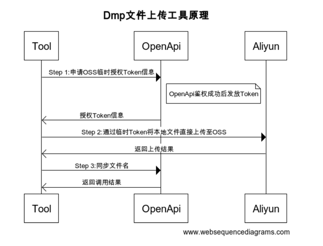

### 趣智营销DMP文件上传工具

API参考：https://openapi.aiclk.com/docs

您可以选择：
1. 直接下载二进制文件(bin目录下)，添加execute权限后，在linux环境下直接使用
2. 下载源码包，自己进行修改编译

以下介绍 dmp-upload-tool 工具的使用方法

```shell
dmp-upload-tool version: 1.0.0
Usage: dmp-upload-tool [-at access_token] [-s sts_api] [-l local_file] [-f file_name]

Options:
  -at access token
        access token for the developer platform
  -f file_name
        the remote file_name of the uploaded file (default "file")
  -h    this help
  -l local_file
        path of the local_file to be uploaded
  -s STS
        the url used to obtain an STS authorization (default "https://openapi.aiclk.com/openapi/oss/sts")

````

-at : 填写开发者平台中分配的AccessToken

-f  : 填写上传后的文件后缀名，文件最终的名称格式为：{UUID}_{file_name}

-l  : 本地的文件路径

-s  : 开发者平台提供的OSS临时授权API地址（选填，有默认值）

示例：

```shell script

$ dmp-upload-tool -at 11e03d30e734ad3676627930b4593e2c1b7830e0c28e2e2aa2f -l /data/dmp/audience.txt 

````

工具执行原理：



工具执行时会打印日志：
```shell script
Step 1：获取STS临时授权
        成功
Step 2：OSS文件上传
        成功，文件名[2147483647147486/dmp/bed2852d-4817-432b-a5ed-31afc8e9bedf_file]
Step 3：文件名同步趣智营销
        成功
````
如果执行过程中出现错误，会有对应的日志打印

问题请联系 xieao@qutoutiao.net
